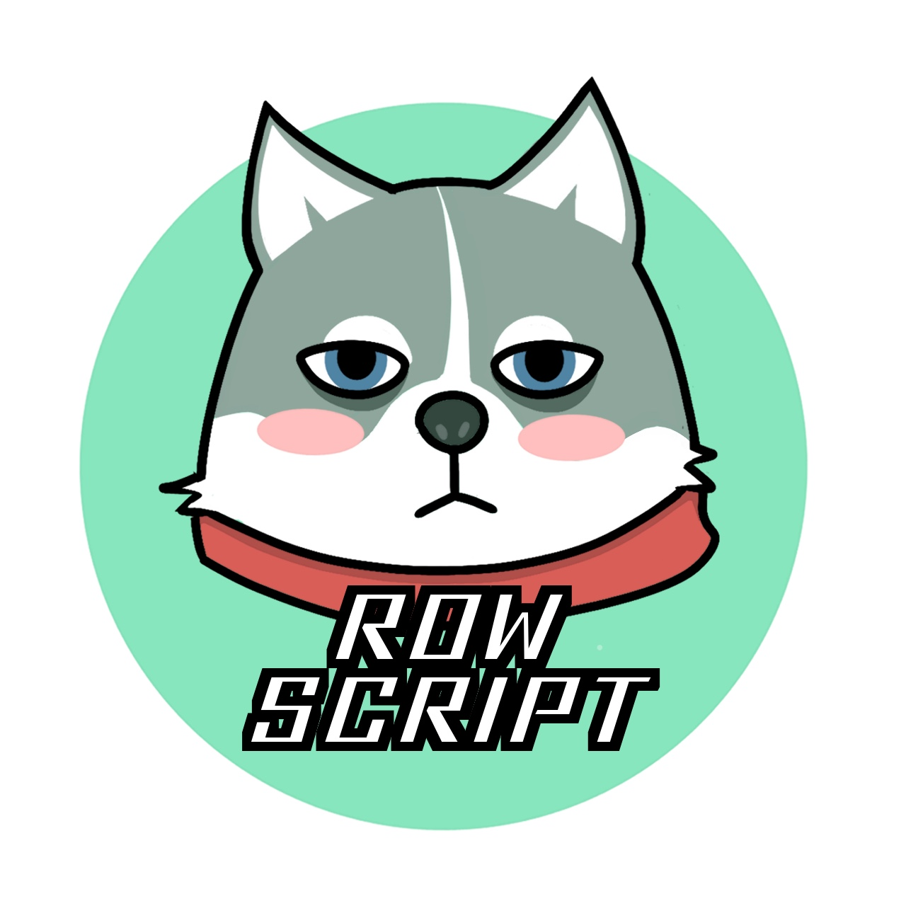

<!--suppress HtmlDeprecatedAttribute -->
<h1 align="center">
<!--suppress CheckImageSize -->

<br>
RowScript
</h1>


[RowScript] is a robustly typed functional language that compiles to efficient and reliable JavaScript. It has a
user-friendly syntax like TypeScript, and many advanced features like typeclass, effect system, and static reflection.

[RowScript]: https://rows.ro

## Example

A hello-world example:

```ts
console.log("Hello, RowScript!");
```

More complicated example with classes and interfaces:

<!-- @formatter:off -->

```ts
class Person {
    name: string;

    dial() {
        console.log(this.name)
    }
}

interface Phonebook {
    dial(a: this);
}

function dialPerson<P>(person: P)
with Phonebook<P>
{
    person.dial();
}

dialPerson(new Person("John Doe"));
```

<!-- @formatter:on -->

## Installation

```bash
$ pnpm install -D rowscript
```

Oh, `npm` is okay too.

## Development status

This project is at early stage and under active development, syntax and APIs are expected to change.

We separate our development into following phases:

* [x] Proof-of-concept research ideas and a most viable compiler
* [x] Get ready for open-sourcing, targeting the **library writer** user group
* [ ] Get ready for production, targeting the **application writer** (end users) user group

## License

MIT
